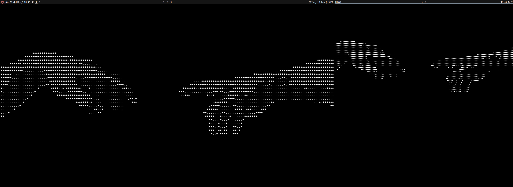
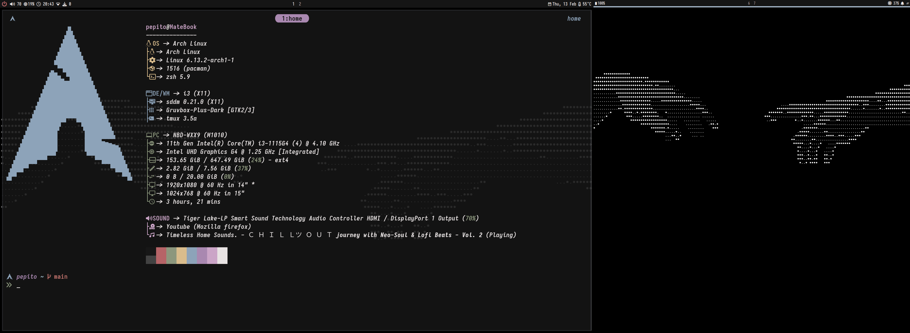
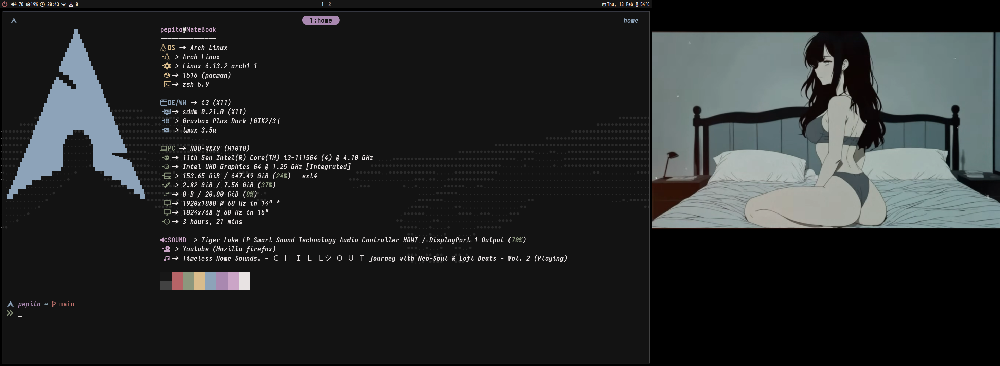

# dotfiles

1. Clone the repository

```
git clone https://github.com/devaspepito/dotfiles.git ~
```

2. Copy the config files to .config folder

```
cp -r ~/dotfiles/.config/* ~/.config/
```

3. Copy the .zshrc file to home

```
cp -r ~/dotfiles/.zshrc ~
```

# Images

##### 2 Monitors in desktops



##### 2 Monitors 1st in terminal 2nd in desktop



##### 2 Monitors 1st in terminal 2nd in web browser


